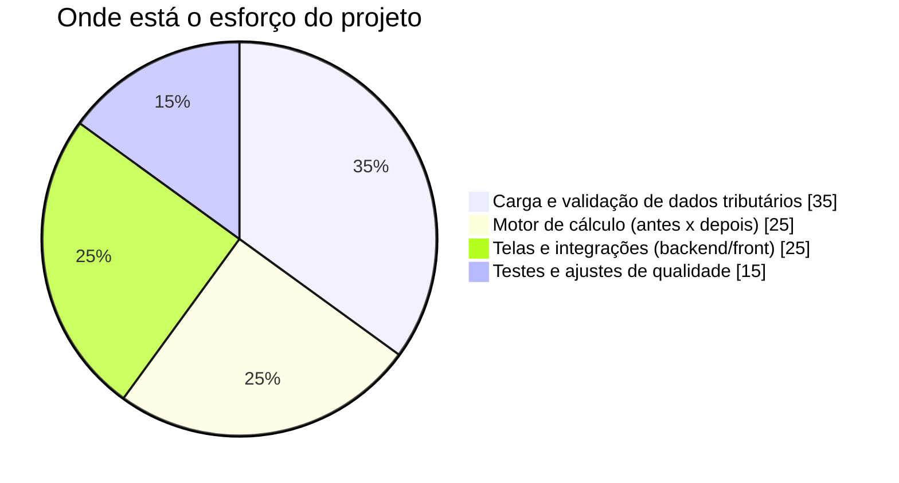
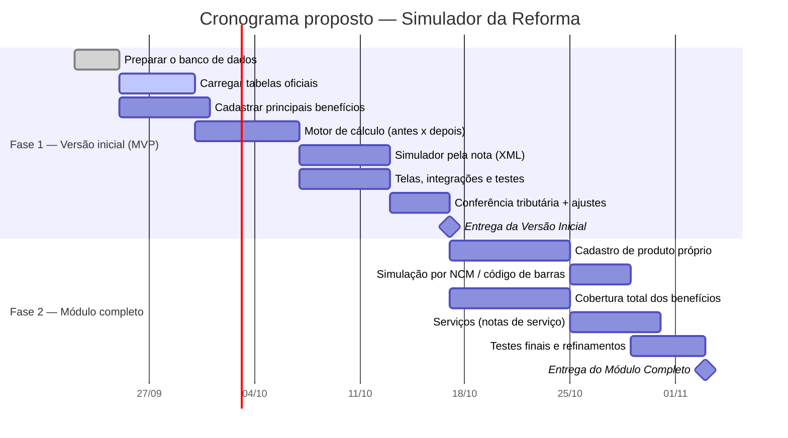

# Relatório de Prazo — Simulador da Reforma Tributária

**Sistema:** Fiscal Fácil
**Módulo:** Simulador da Reforma Tributária (IBS / CBS / IS)
**Data:** 18/09/2026
**Para:** Sócios e diretoria
**De:** Coordenação de Desenvolvimento

---

## 1. Resumo em uma página

Estamos desenvolvendo o **Simulador da Reforma Tributária**: uma ferramenta que responde à pergunta que os clientes mais têm feito —

> *"Com a reforma, quanto eu pagava antes e quanto vou pagar depois neste produto ou nesta nota fiscal?"*

**A pergunta dos sócios:** dá para entregar em **30 dias**?

**A resposta honesta:**

| Cenário | Prazo realista | Cabe em 30 dias? |
|---|---|---|
| **Versão inicial (MVP)** — simulador a partir do XML da nota, com os principais benefícios (cesta básica, saúde, educação) | **~5 semanas (35 dias)** | ⚠️ Quase — cabe se focarmos só no essencial |
| **Módulo completo** — inclui cadastro de produto próprio, busca por NCM, serviços e cobertura total das regras | **~9 a 10 semanas** | ❌ Não |

**Recomendação:** entregar em **2 fases**. Uma versão inicial funcional e demonstrável em ~5 semanas, e o restante em mais ~4 semanas. Isso entrega valor rápido ao cliente sem comprometer a qualidade nem a segurança fiscal.

---

## 2. Por que não cabe tudo em 30 dias?

O trabalho **não é só programação**. A parte mais delicada — e que não dá para acelerar com ferramentas de IA — é a **inteligência tributária**: carregar e conferir as tabelas oficiais (milhares de códigos NCM, situações tributárias, benefícios dos anexos da lei) e garantir que cada cálculo esteja fiel à legislação.

> **Ponto-chave:** cerca de **1/3 do esforço** depende da conferência tributária, feita pelo profissional sênior. Isso é um trabalho cuidadoso e sequencial — apressá-lo significaria colocar em risco a confiabilidade dos números apresentados ao cliente.

---

## 3. A equipe e a capacidade real

| Pessoa | Função | Dedicação a este projeto |
|---|---|---|
| Sênior / DBA (líder) | Banco de dados, motor de cálculo, validação tributária | Parcial (~50%) — também conduz a infraestrutura |
| Programador quase-pleno | Motor de cálculo e telas | Alta (~90%) |
| Programador júnior | Cadastros, telas e testes (com apoio) | Média (~60%) |
| Colaborador de infraestrutura | Suporte de ambiente | Indireta (absorvida pelo líder) |

Na prática, isso equivale a **cerca de 2 pessoas dedicadas em tempo integral**. O uso do **GitHub Copilot** acelera a parte repetitiva (telas, cadastros, testes), mas **não substitui** a decisão tributária nem a conferência dos dados.

---

## 4. Proposta de entrega em 2 fases

### O que entra em cada fase

| | **Fase 1 — Versão Inicial (~5 semanas)** | **Fase 2 — Completo (+~4 semanas)** |
|---|---|---|
| Simulação a partir do **XML da nota** | ✅ | ✅ (refinado) |
| Comparativo **Antes × Depois** por item | ✅ | ✅ |
| Principais benefícios (cesta básica, saúde, educação) | ✅ | ✅ (cobertura total) |
| **Cadastro de produto** próprio do Fiscal Fácil | — | ✅ |
| Simulação por **NCM / código de barras** | — | ✅ |
| Simulação de **serviços** | — | ✅ |
| Alíquotas provisórias (ainda não definidas em lei) | ✅ *(sinalizadas como provisórias)* | ✅ *(atualizadas conforme a lei sair)* |

> **Importante:** como o governo **ainda não publicou as alíquotas definitivas**, a ferramenta já é construída para atualizar esses percentuais **sem reprogramação** — basta atualizar uma tabela. Assim, quando os valores saírem, o simulador fica correto imediatamente.

---

## 5. Marcos e datas de referência

| Marco | Data aproximada | O que o cliente vê |
|---|---|---|
| 🏁 Início | 22/09/2026 | — |
| ✅ **Versão Inicial (MVP)** | **fim de outubro/2026** | Já simula a partir da nota fiscal e mostra o comparativo |
| ✅ **Módulo Completo** | **fim de novembro/2026** | Cadastro de produto, busca por NCM e serviços |

Ambas as entregas ficam **prontas antes da vigência da reforma** (dezembro/2026–janeiro/2027), dando margem para testes com notas reais de clientes.

---

## 6. Riscos e como os controlamos

| Risco | Impacto | Como mitigamos |
|---|---|---|
| Governo demora a publicar alíquotas | Médio | Tabela de alíquotas separada e atualizável sem reprogramar |
| Volume e conferência dos dados tributários | Alto | Faseamento: começamos pelos benefícios mais usados |
| Equipe enxuta e líder dividido com infraestrutura | Médio | Copilot na parte repetitiva; foco do sênior no que é crítico |
| Casos especiais da nota (Substituição Tributária, isentos) | Médio | Já previstos no cálculo para não distorcer o "antes" |
| Expectativa de 30 dias para o módulo completo | Alto | Este relatório alinha a entrega em 2 fases |

---

## 7. Como vamos medir o andamento

Para dar **transparência semanal** aos sócios, acompanhamos indicadores simples:

| Indicador | O que mostra | Meta |
|---|---|---|
| % de etapas concluídas | Avanço frente ao cronograma | Em linha com o plano |
| % de tabelas oficiais carregadas e conferidas | Maturidade da base tributária | 100% antes de liberar |
| Cobertura de testes | Confiabilidade do cálculo | ≥ 70% no motor |
| Tempo de resposta da simulação | Experiência do usuário | Abaixo de 1 segundo |
| Itens revisados pela área tributária | Segurança fiscal | 100% antes de produção |

---

## 8. Recomendação final

1. **Aprovar a entrega em 2 fases.** A Versão Inicial em **~5 semanas** entrega, na prática, o que os clientes pediram: simular a nota e ver o "antes × depois".
2. **Tratar o prazo de 30 dias como meta da Versão Inicial**, não do módulo completo.
3. **Completar o módulo em mais ~4 semanas**, com cadastro de produto, NCM e serviços.

Assim, entregamos **valor rápido**, com **qualidade e segurança fiscal**, e chegamos **prontos antes da reforma entrar em vigor**.

---

> **Anexos técnicos (para a equipe de desenvolvimento):**
> - Estrutura do banco de dados: [schema_tax_reform.md](schema_tax_reform.md) · [schema_tax_reform.sql](schema_tax_reform.sql)
> - Lógica de negócio detalhada: [relatorio_simulador_reforma_tributaria.md](relatorio_simulador_reforma_tributaria.md)
</content>
</invoke>
