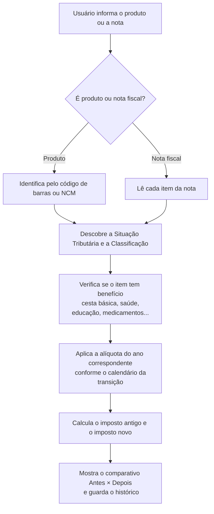

# Relatório Explicativo — Simulador da Reforma Tributária

**Sistema:** Fiscal Fácil
**Módulo:** Simulador da Reforma Tributária (IBS / CBS / IS)
**Data:** 15/09/2026
**Público deste documento:** sócios e área tributária (linguagem de negócio, sem termos técnicos de programação)

---

## 1. Para que serve este módulo

Estamos construindo uma ferramenta que responde, na prática, à pergunta que todo cliente vai fazer nos próximos anos:

> "Com a Reforma Tributária, **quanto eu pagava antes e quanto vou pagar depois** neste produto ou nesta nota fiscal?"

O simulador faz esse comparativo automaticamente, de duas formas:

1. **Simulação por Produto** — o usuário informa um produto (pelo **código de barras** ou pela **NCM**) e o sistema mostra como ele será tributado no novo modelo: alíquota de **IBS** (parte estadual e municipal), **CBS** (federal), e se há alguma **redução, isenção ou regime especial** (por exemplo, cesta básica, medicamentos, saúde, educação).

2. **Simulação por Nota Fiscal ("Antes × Depois")** — o usuário envia uma nota fiscal atual (NF-e ou NFC-e) e o sistema recalcula item a item, mostrando lado a lado:
   - **Modelo atual:** ICMS + PIS + COFINS + ISS
   - **Modelo novo:** IBS + CBS + IS

O resultado é um relatório claro de **quanto muda a carga tributária** — para mais ou para menos.

---

## 2. Como o sistema "pensa" — o processo passo a passo

Para o sistema conseguir tributar corretamente, ele precisa reproduzir o mesmo raciocínio que um profissional de tributação faz. O caminho é este:

Em palavras simples:

1. **Identifica o produto** — pela NCM (bens) ou pela lista de serviços/NBS (serviços), ou diretamente pelo código de barras.
2. **Classifica tributariamente** — descobre o **CST** (Código de Situação Tributária do IBS/CBS) e o **cClassTrib** (a classificação de 6 dígitos que diz exatamente o tratamento e o percentual de redução).
3. **Aplica benefícios e exceções** — verifica se aquele produto/serviço está em algum Anexo da Lei Complementar 214/2025 (cesta básica com alíquota zero, saúde e educação com redução de 60%, medicamentos, insumos agropecuários, etc.).
4. **Aplica a alíquota do ano** — respeita o calendário da transição (2026 a 2033), pois cada ano tem percentuais diferentes.
5. **Compara e registra** — calcula o imposto no modelo antigo e no novo, mostra a diferença e **guarda tudo** para auditoria futura.

---

## 3. Como cada arquivo da documentação foi aproveitado

Toda a documentação que você organizou foi analisada e transformada em estrutura de dados. Segue o "de/para" de cada peça:

| Arquivo que você separou | Para que serve no simulador |
|--------------------------|------------------------------|
| **CST_INDICADORES** | Base dos **Códigos de Situação Tributária** do IBS/CBS (000 integral, 200 reduzida, 400 isenção, 510 diferimento, 620 monofásica, etc.) e seus indicadores. |
| **cClassTrib 2026-06-22** | O detalhamento de cada situação em código de 6 dígitos, com o **percentual exato de redução** do IBS e da CBS e a base legal (artigos da LC 214/2025). |
| **Tabela NCM 2022 com uTrib (IT2024.001)** | Catálogo oficial de **NCM** (mercadorias) usado na identificação de produtos. |
| **Anexos da LC 214** | As **exceções e benefícios**: Anexo I (cesta básica — alíquota zero), Anexos II e III (educação e saúde — redução 60%), Anexos IV/V/VI (medicamentos e dispositivos), Anexo IX (insumos agropecuários), Anexo X (cultura). |
| **Lista de Serviços (LC 116) + NBS + Anexo VIII** | Identificação e classificação de **serviços**, ligando o item da lista de serviços à NBS e à classificação de IBS/CBS. |
| **Tabela CFOP (indExcIBSCBS)** | Identifica operações que **ficam fora** do campo de incidência do IBS/CBS. |

Ou seja: **nada foi inventado**. Cada regra do sistema tem origem rastreável em um desses documentos oficiais.

---

## 4. As "gavetas" de informação (organização dos dados)

O sistema organiza a informação em cinco grandes grupos. Pense em cada grupo como um conjunto de gavetas de um arquivo tributário:

### Gaveta 1 — Referência Tributária (o "dicionário fiscal")
- **Situações Tributárias (CST):** a lista dos códigos de situação (integral, reduzida, isenta, diferida, monofásica...).
- **Classificações (cClassTrib):** o detalhamento de cada situação, com o percentual de redução do IBS e da CBS. **É aqui que o sistema descobre *quanto* reduzir.**

> Regra de ouro do cálculo: **alíquota efetiva = alíquota de referência do ano × (1 − percentual de redução)**.
> Exemplo: cesta básica tem redução de 100% → a alíquota fica em **zero**. Saúde e educação têm redução de 60% → paga-se 40% da alíquota cheia.

### Gaveta 2 — Catálogos de Busca
- **NCM:** catálogo de mercadorias para encontrar o produto.
- **Produtos (código de barras):** liga o código de barras (EAN/GTIN) à NCM e à classificação padrão, para busca instantânea no PDV/estoque.

### Gaveta 3 — Regras e Exceções (os Anexos da LC 214)
- **Regras:** cada benefício vira uma regra (cesta básica, saúde, educação, medicamentos, insumos...).
- **Alvos da regra:** os códigos que "acionam" cada benefício. Um recurso importante aqui é poder cadastrar por **família de NCM** — por exemplo, ao citar "arroz das posições 1006.20 e 1006.30", basta cadastrar o início do código que todos os desdobramentos são cobertos.

### Gaveta 4 — Calendário da Transição (2026 a 2033)
- Guarda as **alíquotas de cada ano** e o quanto dos tributos antigos (ICMS/ISS/PIS/COFINS) ainda é cobrado naquele ano. É o que permite simular "como fica em 2027", "como fica em 2030", etc.

### Gaveta 5 — Histórico de Simulações
- **Cabeçalho da simulação:** quem simulou, quando, para qual ano, e os totais.
- **Itens da simulação:** o detalhe item a item, com os impostos antigos e novos lado a lado. **Cada simulação é congelada e guardada**, para que possa ser auditada mesmo que as alíquotas mudem no futuro.

---

## 5. O calendário da transição (resumo tributário)

O simulador considera a transição prevista na Emenda Constitucional 132 e na LC 214/2025:

| Ano | O que acontece | CBS (federal) | IBS (estadual/municipal) | Tributos antigos |
|-----|----------------|---------------|---------------------------|-------------------|
| **2026** | Ano de teste (alíquota simbólica, compensável) | ~0,9% | ~0,1% | ICMS, ISS, PIS e COFINS integrais |
| **2027** | CBS entra "cheia"; **PIS e COFINS são extintos**; começa o Imposto Seletivo (IS) | cheia | ~0,1% | ICMS e ISS integrais |
| **2028** | Manutenção | cheia | ~0,1% | ICMS e ISS integrais |
| **2029 a 2032** | Redução gradual dos tributos antigos | cheia | crescente | ICMS/ISS caem: 90% → 80% → 70% → 60% |
| **2033** | Modelo pleno | cheia | cheia | ICMS, ISS, PIS e COFINS **extintos** |

> A alíquota de referência total (IBS + CBS) estimada é de aproximadamente **26,5%**. Os valores exatos de cada ano serão cadastrados conforme a regulamentação for publicada — por isso o sistema mantém uma tabela separada de alíquotas por ano, fácil de atualizar sem mexer no restante.

---

## 6. Exemplo prático — Arroz (cesta básica)

Para deixar concreto, veja como o sistema trata um item de **cesta básica**:

- **Produto:** Arroz tipo 1, NCM 1006.30.21
- **Identificação:** o sistema localiza a NCM e verifica que ela está no **Anexo I da LC 214** (Cesta Básica Nacional).
- **Classificação:** aplica a situação de **alíquota reduzida** com **redução de 100%** → resultado **alíquota zero** de IBS e CBS.
- **Comparativo em uma venda de R$ 2.500,00:**

| Modelo | Tributos | Valor |
|--------|----------|-------|
| **Antes** | ICMS + PIS + COFINS | R$ 531,25 |
| **Depois** | IBS + CBS + IS | **R$ 0,00** |
| **Diferença** | | **− R$ 531,25 (redução total)** |

O mesmo raciocínio vale para saúde e educação (redução de 60%), medicamentos (conforme anexo) e demais regimes.

---

## 7. Garantias importantes do projeto

- **Rastreabilidade total:** cada simulação guarda uma "fotografia" do cálculo e da regra aplicada no momento. Se a legislação mudar depois, a simulação antiga continua reproduzível — essencial para auditoria e defesa fiscal.
- **Atualização sem retrabalho:** alíquotas e benefícios ficam em tabelas próprias. Quando sair nova regulamentação, atualiza-se apenas o cadastro, sem reprogramar o sistema.
- **Fidelidade às fontes oficiais:** toda regra aponta para o Anexo e o artigo da LC 214/2025 que a originou.
- **Cobertura de bens e serviços:** o modelo trata tanto mercadorias (via NCM/código de barras) quanto serviços (via lista de serviços da LC 116 e NBS).

---

## 8. Glossário rápido (termos técnicos ↔ significado)

Alguns nomes internos do sistema estão em inglês por padrão de programação. A tradução é esta:

| Nome técnico no sistema | Significado tributário |
|-------------------------|-------------------------|
| `cst` | Código de Situação Tributária do IBS/CBS |
| `tax_classifications` | Classificação Tributária (cClassTrib) |
| `p_reduction_ibs` / `p_reduction_cbs` | Percentual de redução da alíquota do IBS / da CBS |
| `benefit_type` | Tipo de benefício (integral, reduzido, zero, isento, imune, diferido, monofásico...) |
| `ncms` | Catálogo de NCM (mercadorias) |
| `products_ref` | Catálogo de produtos por código de barras (EAN/GTIN) |
| `rules_and_exceptions` | Regras e exceções dos Anexos da LC 214 |
| `rule_targets` | Códigos (NCM/NBS/CEST...) que acionam cada regra |
| `transition_rates` | Alíquotas por ano (calendário da transição) |
| `simulations` | Cabeçalho de cada simulação realizada |
| `simulation_items` | Detalhe item a item (comparativo Antes × Depois) |
| `old_...` (ex.: `old_icms_value`) | Valores do **modelo antigo** (ICMS, PIS, COFINS, ISS) |
| `new_...` (ex.: `new_cbs_value`) | Valores do **modelo novo** (IBS estadual/municipal, CBS, IS) |
| `reference_year` | Ano de referência da simulação |
| `legacy_..._factor` | Fração dos tributos antigos ainda cobrada no ano |

---

## 9. Próximos passos

1. **Carga inicial dos dados (seeds):** popular as tabelas de situações, classificações e alíquotas a partir das planilhas oficiais que você organizou.
2. **Validação tributária:** revisão dos percentuais de cada ano e dos benefícios por anexo — ponto em que sua expertise será fundamental.
3. **Testes com notas reais:** rodar simulações com notas fiscais de clientes para conferir os resultados na prática.

---

> **Observação final:** este documento descreve o *planejamento* e a *lógica de negócio*. O detalhamento técnico completo (estrutura das tabelas, colunas e índices) está no documento técnico [schema_tax_reform.md](schema_tax_reform.md), voltado à equipe de desenvolvimento.
