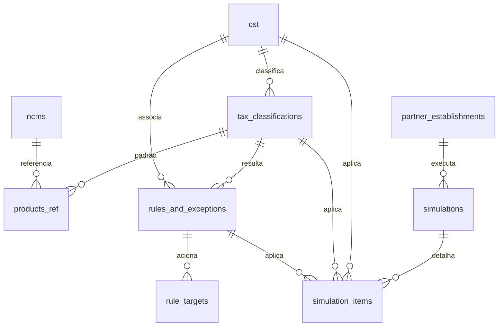
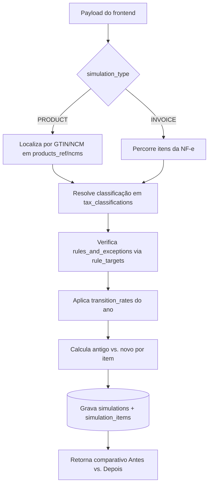

# Schema `tax_reform` — Simulador da Reforma Tributária

> Documentação técnica do módulo **Simulador da Reforma Tributária** (IBS/CBS/IS) do sistema **Fiscal Fácil**.
> Arquivo DDL: [schema_tax_reform.sql](schema_tax_reform.sql)

---

## 1. Visão Geral

O schema `tax_reform` sustenta duas jornadas de simulação:

1. **Simulação por Produto / Catálogo** — busca por Código de Barras (EAN/GTIN) e NCM, aplicando as alíquotas de **IBS** (estadual/municipal) e **CBS** (federal), respeitando travas de alíquotas reduzidas/isentas e regimes especiais.
2. **Simulação por Nota Fiscal ("Antes vs. Depois")** — recebe uma NF-e/NFC-e do modelo atual e projeta a carga tributária sob o novo modelo, comparando `ICMS/PIS/COFINS/ISS` (antigo) contra `IBS/CBS/IS` (novo).

O desenho separa três responsabilidades:

| Bloco | Tabelas | Papel |
|-------|---------|-------|
| **Referência tributária** | `cst`, `tax_classifications` | O "dicionário" de como cada situação é tributada (motor de alíquotas). |
| **Catálogos de busca** | `ncms`, `products_ref` | Como localizar o item a partir de NCM ou código de barras. |
| **Regras e exceções** | `rules_and_exceptions`, `rule_targets` | Benefícios dos Anexos da LC 214/2025 (cesta básica, saúde, educação, etc.). |
| **Transição temporal** | `transition_rates` | Alíquotas e fatores ano a ano (2026→2033+). |
| **Histórico** | `simulations`, `simulation_items` | Persistência auditável do "de/para" de cada simulação. |

### Diagrama de relacionamentos

---

## 2. Convenções adotadas

- **PK exposta ao frontend** → `UUID` com `gen_random_uuid()` (`simulations`, `rules_and_exceptions`).
- **PK interna de alto volume** → `BIGINT GENERATED ALWAYS AS IDENTITY` (`ncms`, `products_ref`, `tax_classifications`, `simulation_items`, `rule_targets`, `transition_rates`).
- **Valores e alíquotas** → `NUMERIC(15,4)`. Percentuais de redução são frações: `0.6000` = 60%, `1.0000` = alíquota zero.
- **Snapshots e regras dinâmicas** → `JSONB` (`indicators`, `conditions`, `input_payload`, `comparison_payload`).
- **Timestamps** → `created_at`/`updated_at` (`TIMESTAMPTZ`), atualizados pela trigger central `public.fn_update_timestamp()`.
- **FTS** → configuração `public.simple_portuguese` + `unaccent`, com sufixo `_fts`.
- **Nomes** → `snake_case`; constraints `uk_`/`fk_`/`ck_`; índices `idx_`.

### Tipos (ENUMs)

| Tipo | Valores | Uso |
|------|---------|-----|
| `new_tax_kind` | `IBS_ESTADUAL`, `IBS_MUNICIPAL`, `CBS`, `IS` | Tributos do novo modelo. |
| `benefit_kind` | `INTEGRAL`, `REDUCED`, `ZERO`, `EXEMPT`, `IMMUNE`, `DEFERRED`, `SUSPENDED`, `MONOPHASIC`, `FIXED_RATE`, `SPECIFIC_REGIME` | Natureza do tratamento tributário. |
| `rule_scope` | `NCM`, `NBS`, `LC116_ITEM`, `CEST`, `GTIN` | Por qual chave a regra é localizada. |
| `match_kind` | `EXACT`, `PREFIX` | Estratégia de correspondência de código. |
| `simulation_kind` | `PRODUCT`, `INVOICE` | Modo da simulação. |
| `simulation_status` | `DRAFT`, `COMPLETED`, `FAILED` | Estado da simulação. |

---

## 3. Tabelas de Referência Tributária

### 3.1 `cst` — Código de Situação Tributária do IBS/CBS

Dicionário-base dos CSTs (fonte: `CST_INDICADORES`). Cada CST define quais grupos de informação são exigidos no documento fiscal.

| Coluna | Tipo | Descrição |
|--------|------|-----------|
| `cst_code` **(PK)** | `VARCHAR(3)` | Código de 3 dígitos (ex.: `000`, `200`, `510`). |
| `cst_description` | `VARCHAR(255)` | Descrição oficial (ex.: "Tributação integral"). |
| `allowed_in_icms_dfe` | `BOOLEAN` | Permitido em DFe modelo ICMS na transição. |
| `ind_ibscbs` | `BOOLEAN` | Exige grupo de tributação regular IBS/CBS. |
| `ind_ibscbs_mono` | `BOOLEAN` | Exige grupo de tributação monofásica. |
| `ind_reduction` | `BOOLEAN` | Há redução de alíquota associada. |
| `ind_deferral` | `BOOLEAN` | Corresponde a diferimento. |
| `ind_regular_taxation` | `BOOLEAN` | Tributação regular (pode exigir avaliação na cClassTrib). |
| `created_at` / `updated_at` | `TIMESTAMPTZ` | Auditoria. |

**CSTs principais:** `000` integral · `200` reduzida · `210` redução com redutor de BC · `220` fixa · `400` isenção · `410` imunidade · `510` diferimento · `550` suspensão · `620` monofásica · `800/810/820` ajustes/regimes.

### 3.2 `tax_classifications` — Classificação Tributária (cClassTrib)

Detalha cada CST em um código de 6 dígitos com o **percentual de redução** e a base normativa (fonte: `cClassTrib 2026-06-22`). É aqui que o simulador descobre *quanto* reduzir.

| Coluna | Tipo | Descrição |
|--------|------|-----------|
| `tax_class_id` **(PK)** | `BIGINT` | Identificador interno. |
| `cst_code` **(FK→cst)** | `VARCHAR(3)` | CST ao qual pertence. |
| `class_trib_code` **(UK)** | `VARCHAR(6)` | Código cClassTrib (ex.: `000001`, `200038`). |
| `class_trib_name` | `VARCHAR(500)` | Nome/título. |
| `benefit_type` | `benefit_kind` | Natureza do tratamento. |
| `p_reduction_ibs` | `NUMERIC(15,4)` | Redução da alíquota do IBS (`0.6000`=60%; `1.0000`=zero). |
| `p_reduction_cbs` | `NUMERIC(15,4)` | Redução da alíquota da CBS. |
| `class_trib_description` | `TEXT` | Descrição detalhada. |
| `rate_type` | `VARCHAR(50)` | Tipo de alíquota (Padrão, Fixa). |
| `legal_basis` | `TEXT` | Base legal (artigo LC 214/25). |
| `cbs_regulation` / `ibs_regulation` | `TEXT` | Referência aos regulamentos. |
| `anexo_ref` | `VARCHAR(50)` | Anexo relacionado. |
| `source_link` | `TEXT` | URL da fonte oficial. |
| `indicators` | `JSONB` | Snapshot dos indicadores originais da planilha. |
| `valid_from` / `valid_to` | `DATE` | Vigência (`valid_to` nulo = vigente). |

> **Regra de negócio:** a alíquota efetiva = `alíquota de referência do ano` × `(1 − p_reduction)`. Cesta básica usa `p_reduction = 1.0000` → resultado zero.

---

## 4. Catálogos de Busca

### 4.1 `ncms` — Catálogo NCM/SH

Base de busca por mercadoria (fonte: `IT2024.001 - Tabela NCM/uTrib`).

| Coluna | Tipo | Descrição |
|--------|------|-----------|
| `ncm_id` **(PK)** | `BIGINT` | Identificador interno. |
| `ncm_code` **(UK)** | `VARCHAR(8)` | Código NCM de 8 dígitos (validado por `ck` regex). |
| `ncm_description` | `TEXT` | Descrição oficial da mercadoria. |
| `utrib_export_abbr` | `VARCHAR(10)` | Unidade tributável de exportação (ex.: `UN`). |
| `utrib_export_description` | `VARCHAR(100)` | Descrição da unidade. |
| `valid_from` / `valid_to` | `DATE` | Vigência do código. |
| `ncm_fts` | `TSVECTOR` | Busca textual por código/descrição. |

### 4.2 `products_ref` — Catálogo de Produtos (EAN/GTIN)

Liga o **código de barras** ao NCM e à classificação padrão, alimentando a simulação por produto.

| Coluna | Tipo | Descrição |
|--------|------|-----------|
| `product_ref_id` **(PK)** | `BIGINT` | Identificador interno. |
| `ncm_id` **(FK→ncms)** | `BIGINT` | NCM vinculado (`ON DELETE SET NULL`). |
| `gtin` **(UK)** | `VARCHAR(14)` | Código de barras EAN/GTIN (8–14 dígitos). |
| `ncm_code` | `VARCHAR(8)` | NCM desnormalizado para busca rápida. |
| `product_description` | `VARCHAR(500)` | Descrição comercial. |
| `cest_code` | `VARCHAR(7)` | CEST quando aplicável. |
| `default_class_trib_code` **(FK)** | `VARCHAR(6)` | Classificação tributária padrão. |
| `product_fts` | `TSVECTOR` | Busca por GTIN/descrição/NCM/CEST. |

> **Nota de performance:** `ncm_code` é intencionalmente **desnormalizado** aqui (além do FK `ncm_id`) para permitir busca direta sem JOIN no caminho crítico do simulador.

---

## 5. Regras e Exceções (Anexos LC 214/2025)

### 5.1 `rules_and_exceptions` — Regras condicionais

Materializa os benefícios dos Anexos: cesta básica (alíquota zero), saúde/educação (redução 60%), medicamentos, insumos agropecuários e regimes específicos.

| Coluna | Tipo | Descrição |
|--------|------|-----------|
| `rule_id` **(PK)** | `UUID` | Identificador exposto. |
| `tax_class_id` **(FK)** | `BIGINT` | Classificação resultante da regra. |
| `rule_code` **(UK)** | `VARCHAR(50)` | Código interno (ex.: `CESTA_BASICA_ANEXO_I`). |
| `rule_name` | `VARCHAR(500)` | Nome descritivo. |
| `benefit_type` | `benefit_kind` | Natureza do benefício. |
| `scope_type` | `rule_scope` | Escopo de localização (NCM/NBS/LC116/CEST/GTIN). |
| `p_reduction_ibs` / `p_reduction_cbs` | `NUMERIC(15,4)` | Redução aplicada. |
| `cst_code` / `class_trib_code` **(FK)** | — | Vínculos de classificação. |
| `anexo_ref` | `VARCHAR(50)` | Anexo de origem (ex.: `Anexo I`). |
| `legal_basis` | `TEXT` | Base legal (ex.: `Art. 125 LC 214/25`). |
| `conditions` | `JSONB` | Condições compostas avaliadas em runtime. |
| `valid_from` / `valid_to` | `DATE` | Vigência. |

### 5.2 `rule_targets` — Alvos de correspondência

Mapeia cada regra aos códigos que a acionam. O `match_type = PREFIX` cobre **famílias inteiras de NCM** com um único registro.

| Coluna | Tipo | Descrição |
|--------|------|-----------|
| `rule_target_id` **(PK)** | `BIGINT` | Identificador interno. |
| `rule_id` **(FK→rules)** | `UUID` | Regra dona (`ON DELETE CASCADE`). |
| `target_scope` | `rule_scope` | Tipo do código. |
| `target_code` | `VARCHAR(30)` | Valor (NCM/NBS/item/CEST/GTIN). |
| `match_type` | `match_kind` | `EXACT` ou `PREFIX`. |
| `target_description` | `TEXT` | Descrição opcional. |

> **Exemplo:** a Cesta Básica cita "arroz das subposições 1006.20 e 1006.30". Registra-se `target_code = '100620'` e `'100630'` com `match_type = PREFIX`, cobrindo todos os NCMs derivados.

---

## 6. `transition_rates` — Alíquotas de Transição (2026→2033+)

Parametriza a projeção gradual do novo modelo e a redução dos tributos antigos. **UK** por `(reference_year, tax_kind)`.

| Coluna | Tipo | Descrição |
|--------|------|-----------|
| `transition_rate_id` **(PK)** | `BIGINT` | Identificador interno. |
| `reference_year` | `SMALLINT` | Ano (2026–2100). |
| `tax_kind` | `new_tax_kind` | IBS estadual/municipal, CBS ou IS. |
| `standard_rate` | `NUMERIC(15,4)` | Alíquota de referência do ano. |
| `legacy_icms_iss_factor` | `NUMERIC(15,4)` | Fração de ICMS/ISS ainda devida (`1`=integral, `0`=extinto). |
| `legacy_pis_cofins_factor` | `NUMERIC(15,4)` | Fração de PIS/COFINS ainda devida. |
| `phase_description` | `VARCHAR(255)` | Descrição da fase. |
| `valid_from` / `valid_to` | `DATE` | Vigência. |

### Cronograma de transição (referência para o seed)

| Ano | Fase | CBS | IBS | Legado |
|-----|------|-----|-----|--------|
| 2026 | Teste (compensável) | ~0,9% | ~0,1% | ICMS/ISS/PIS/COFINS integrais |
| 2027 | CBS cheia; extinção PIS/COFINS; início do IS | cheia | ~0,1% | ICMS/ISS integrais |
| 2028 | Manutenção | cheia | ~0,1% | ICMS/ISS integrais |
| 2029–2032 | Redução gradual do legado | cheia | crescente | ICMS/ISS: 90%→80%→70%→60% |
| 2033 | Modelo pleno | cheia | cheia | ICMS/ISS/PIS/COFINS extintos |

> Referência total estimada do IBS+CBS ≈ **26,5%**. Os valores devem ser confirmados e populados via `seeds/` conforme regulamentação vigente.

---

## 7. Histórico de Simulações

### 7.1 `simulations` — Cabeçalho

| Coluna | Tipo | Descrição |
|--------|------|-----------|
| `simulation_id` **(PK)** | `UUID` | Identificador exposto. |
| `est_id` **(FK→partner)** | `UUID` | Estabelecimento que simulou. |
| `tenant_id` / `user_id` | `UUID` | Assinante e usuário. |
| `simulation_type` | `simulation_kind` | `PRODUCT` ou `INVOICE`. |
| `reference_year` | `SMALLINT` | Ano usado para as alíquotas. |
| `status` | `simulation_status` | `DRAFT`/`COMPLETED`/`FAILED`. |
| `source_model` | `VARCHAR(2)` | `55` (NF-e) ou `65` (NFC-e). |
| `source_access_key` | `VARCHAR(44)` | Chave de acesso (validada por `ck`). |
| `input_payload` | `JSONB` | Payload de entrada do frontend. |
| `total_old_tax` | `NUMERIC(15,4)` | Total no regime antigo. |
| `total_new_tax` | `NUMERIC(15,4)` | Total no novo regime. |
| `total_difference` | `NUMERIC(15,4)` | Diferença (negativo = redução). |
| `difference_percent` | `NUMERIC(15,4)` | Variação percentual. |

### 7.2 `simulation_items` — Detalhe "de/para"

O coração do comparativo. Guarda, por item, os tributos **antigos** e **novos** lado a lado, além do snapshot JSONB completo.

| Grupo | Colunas | Descrição |
|-------|---------|-----------|
| **Identificação** | `simulation_item_id` (PK), `simulation_id` (FK), `item_sequence` | Chave e ordenação (UK por `simulation_id + item_sequence`). |
| **Item** | `product_description`, `quantity`, `unit_value`, `item_value` | Dados do produto/serviço. |
| **Classificação** | `gtin`, `ncm_code`, `cst_code` (FK), `class_trib_code` (FK), `applied_rule_id` (FK) | Como o item foi tributado. |
| **Regime antigo** | `old_icms_value`, `old_pis_value`, `old_cofins_value`, `old_iss_value`, `old_total_tax` | Tributos atuais. |
| **Regime novo** | `new_ibs_estadual_value`, `new_ibs_municipal_value`, `new_cbs_value`, `new_is_value`, `new_total_tax` | Tributos da reforma. |
| **Comparativo** | `difference`, `comparison_payload` | Diferença e snapshot JSONB auditável. |

> **Rastreabilidade:** `comparison_payload` congela o cálculo e a regra aplicada no momento da simulação, garantindo reprodutibilidade mesmo após mudanças futuras nas alíquotas.

---

## 8. Índices Estratégicos

| Índice | Objetivo |
|--------|----------|
| `idx_ncms_code`, `idx_ncms_code_prefix` (`text_pattern_ops`) | Busca exata e por prefixo (`LIKE '1006%'`). |
| `idx_products_ref_gtin`, `idx_products_ref_ncm_code` | Busca instantânea por código de barras/NCM. |
| `idx_rule_targets_lookup` (`target_scope, target_code`) | Resolução rápida de regra aplicável ao item. |
| `idx_transition_rates_year` | Carga das alíquotas do ano da simulação. |
| `idx_simulations_access_key` (parcial) | Localizar simulação por chave da NF-e. |
| GIN em `*_fts`, `indicators`, `conditions` | Busca textual e consultas em JSONB. |

---

## 9. Triggers

- `public.fn_update_timestamp()` — atualiza `updated_at` em `cst`, `tax_classifications`, `ncms`, `products_ref`, `rules_and_exceptions`, `transition_rates`, `simulations`.
- `tax_reform.fn_refresh_ncm_fts()` — recalcula `ncm_fts` em INSERT/UPDATE.
- `tax_reform.fn_refresh_product_ref_fts()` — recalcula `product_fts` em INSERT/UPDATE.

---

## 10. Fluxo de uma simulação

